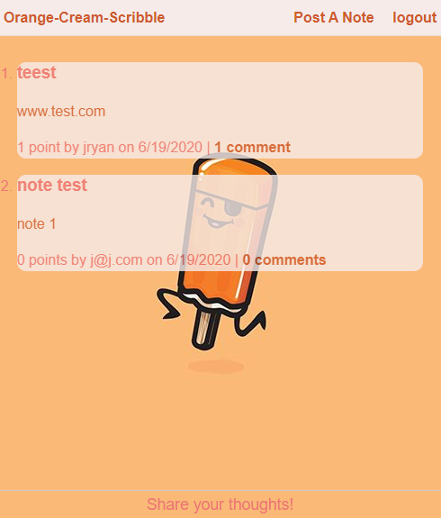

<h1 align="center">CMS Style Blog</h1>

  

## Table of Contents
- [Description](#description)
- [Installation](#install)
- [Usage](#usage)
- [Questions](#questions)

## Description
### This application uses MySql2, nodemon, sequelize, dotenv, and handlebars to create a dynamically generated blog style webpage.

### Screenshot of the webpage:

## Usage
### Create a profile to add remove, and upvote other posts on the page. The PW must be at least six characters.

## Install
npm init  --> npm install mysql2 sequelize dotenv handlebars

npm install nodemon "if you want an easier time testing while changing routes"

## Questions
## Contact me at:
### [JCSRyan](https://github.com/jcsryan)
### JohnConnorSRyan@gmail.com